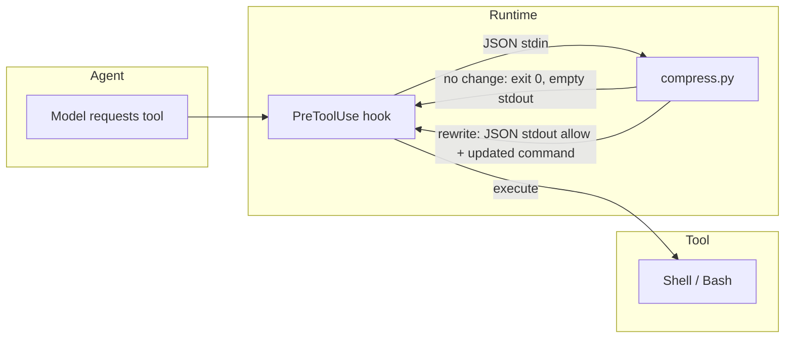
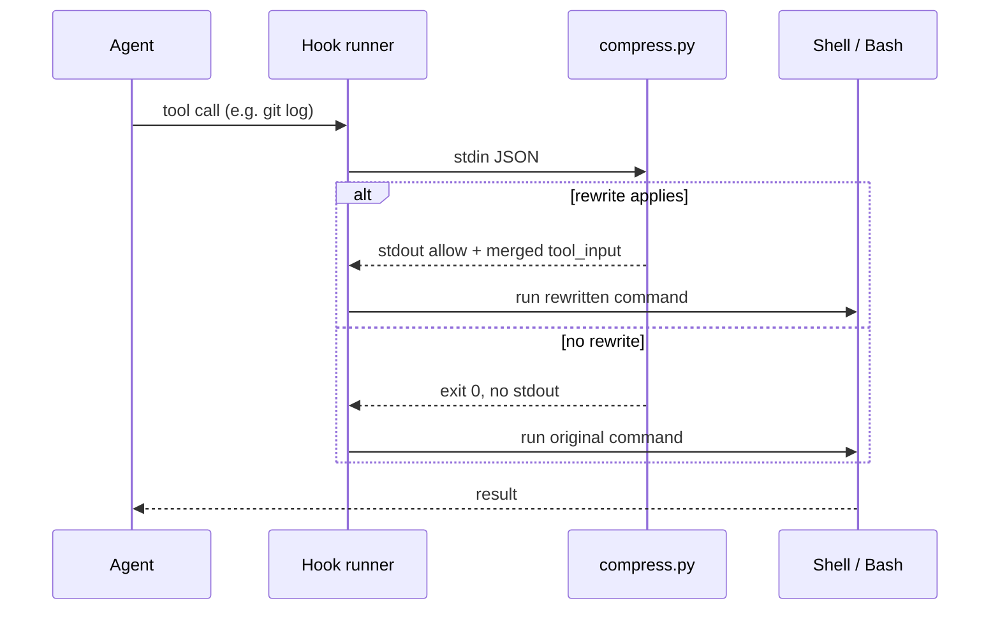

# agent-hooks

Shared **PreToolUse** hook logic for **Cursor** and **Claude Code**. It rewrites verbose shell commands before execution so agents get shorter, easier-to-read output (for example `git log` → `git log --oneline --graph --decorate -30`).

The implementation lives in a single script, [`compress.py`](./compress.py), invoked with `--format cursor` or `--format claude` so each product receives the JSON shape it expects.

## Why this exists

Agent runs often call long-running or noisy commands (`git diff`, `npm install`, `docker build`, …). Rewriting those calls at the hook layer keeps transcripts smaller without asking the model to remember a house style every turn.

## Requirements

- Python 3.10+ (uses `str | None` union syntax)
- No third-party packages (stdlib only)

## Installation

1. Place this repo under a stable path (this machine uses `~/ai-context/agent-hooks/` as part of a single `~/ai-context/` tree for AI-related files).
2. Point each tool’s hook config at `compress.py` (see below).
3. Reload the editor / Claude Code so hook config is picked up.

### Cursor (`~/.cursor/hooks.json`)

User-level hooks run with cwd `~/.cursor/`. You can use an absolute path to `compress.py` or place a copy under `~/.cursor/hooks/` and reference it relatively.

Example (global hook, matcher limits to Shell tool):

```json
{
  "version": 1,
  "hooks": {
    "preToolUse": [
      {
        "command": "python3 /path/to/ai-context/agent-hooks/compress.py --format cursor",
        "matcher": "Shell",
        "timeout": 5
      }
    ]
  }
}
```

See [Cursor Hooks](https://cursor.com/docs/agent/hooks) for event names, matchers, and behavior.

### Claude Code (`~/.claude/settings.json`)

Hooks are nested under `hooks.PreToolUse`. Match on `Bash` so only bash tool calls are rewritten:

```json
{
  "hooks": {
    "PreToolUse": [
      {
        "matcher": "Bash",
        "hooks": [
          {
            "type": "command",
            "command": "python3 /path/to/ai-context/agent-hooks/compress.py --format claude",
            "timeout": 5
          }
        ]
      }
    ]
  }
}
```

Claude Code uses tool name **`Bash`**; Cursor uses **`Shell`** for the same idea.

## Behavior

- **stdin**: JSON from the hook runtime (tool name, tool input, session metadata).
- **stdout**: When a rewrite applies, JSON with `permission` / `updated_input` (Cursor) or `hookSpecificOutput` (Claude). When no rewrite applies, the script prints nothing and exits `0` (allow original tool call).
- **Full tool input merge**: Claude Code replaces the **entire** `tool_input` when you return `updatedInput`, so the script merges all original fields (for example `working_directory`) and only changes `command`. Cursor is documented as accepting partial `updated_input`; merging keeps behavior consistent and safe.
- **Compound shell lines**: The agent usually does not run bare `git log`; it runs `cd /path/to/repo && git log`. The hook walks `&&`- and `;`-separated segments (right to left) and applies the same rewrites to the matching segment, then rejoins the line. Without this, only commands that *start* with `git log` would be compressed.

## Flow



Sequence view:



## Manual testing

From the `agent-hooks` directory, pipe sample payloads (adjust paths if needed):

**Cursor-shaped input**

```bash
printf '%s\n' '{"tool_name":"Shell","tool_input":{"command":"git log","working_directory":"/tmp"}}' \
  | python3 compress.py --format cursor
```

**Claude-shaped input**

```bash
printf '%s\n' '{"tool_name":"Bash","tool_input":{"command":"git log","working_directory":"/tmp"}}' \
  | python3 compress.py --format claude
```

You should see one line of JSON containing the rewritten `command` and the preserved `working_directory`.

**Compound command (important for agents):** the model often runs `cd /path/to/repo && git log`, not bare `git log`. Test that shape too:

```bash
printf '%s\n' '{"tool_name":"Shell","tool_input":{"command":"cd /tmp && git log"}}' \
  | python3 compress.py --format cursor
```

Validate config files:

```bash
python3 -m json.tool ~/.cursor/hooks.json
python3 -m json.tool ~/.claude/settings.json
```

## How to verify in agent chat

Use the same mental model for **Cursor** and **Claude Code**: the hook rewrites `git log` (including after `cd … &&`) into a **short, graph-style** log with about **30 commits**, not an unbounded full history.

### What “working” looks like

Ask the agent something like: *“Run `git log` in the repo root (no extra flags).”*

| Signal | Hook likely **active** | Hook likely **not** active |
|--------|------------------------|----------------------------|
| Line count | Dozens of lines (on the order of **~30** commits worth), often noted as “+N lines” with N small | Thousands of lines, or UI says output was truncated after **~20k characters** / **hundreds or thousands of lines** |
| Commit shape | **One line per commit**: short hash, optional `*` / graph, subject (e.g. `* 53303e8 (HEAD -> branch) message`) | **Multi-line blocks**: full hash, `Author:`, `Date:`, full message body for many commits |
| Command form | Agent may still *say* `git log` or `cd … && git log`; the rewrite happens **before** the shell runs | Same labels, but the **shell output** stays in default `git log` format |

If you are unsure, **temporarily remove or comment out** the `preToolUse` / `PreToolUse` entry in your config, reload the app, run the same prompt, then **restore** the config. You should see a clear swing between verbose log and compact log.

### Cursor

- Open **Output** and select the **Hooks** channel (name may vary slightly by build). When a Shell tool runs, you may see hook activity; if the channel stays empty on every Shell call, check paths, matchers, and restart Cursor.
- The decisive check is still **output shape**: compact one-line/graph commits vs huge default `git log`.

### Claude Code

- Tool calls show as **`Bash(…)`**. For `git log`, success looks like **short graph lines** and a **small** total line count (often tens of lines, e.g. “+28 lines”), not a wall of full commit objects.
- Same **with / without hook** comparison as above if you want a hard proof.

## Rewrite rules (summary)

The script shortens or tails output for common commands: `git`, `npm`/`npx`, `pip`, `aws`, `pytest`, `tsc`, `docker`, `ls`, and similar. It **skips** rewriting when the command already limits output (for example contains `| head`, `--oneline`, or `| jq`).

## Troubleshooting

| Symptom | What to check |
|--------|----------------|
| Hook never runs | Cursor: Hooks panel / logs; ensure `hooks.json` path and `matcher` match your tool name (`Shell`). |
| Claude bash not rewritten | Matcher must be `Bash`; `tool_name` in stdin must be `Bash`. |
| Invalid JSON / hook errors | Run the manual `printf \| python3` tests; confirm Python 3.10+. |
| Claude breaks after rewrite | Ensure you use a current `compress.py` that merges full `tool_input` (not only `command`). |

## License

Use and modify for your own setup; no warranty implied.
