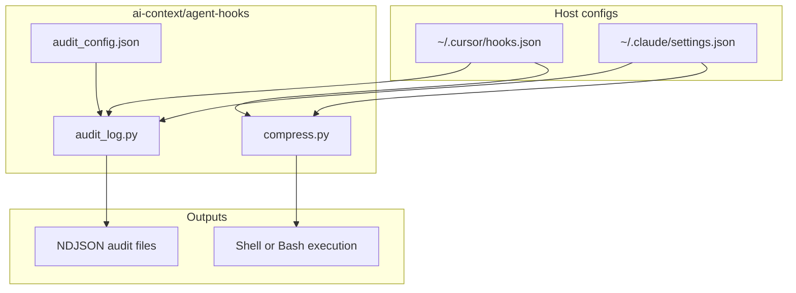
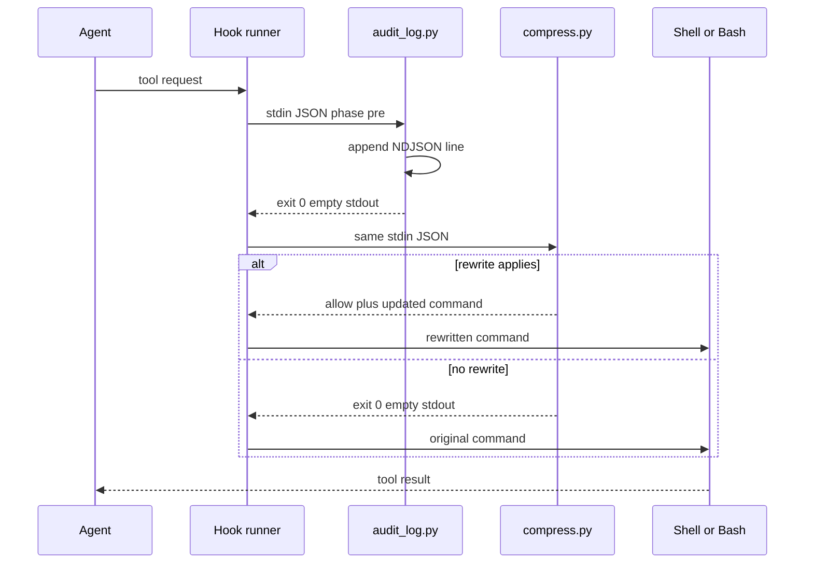
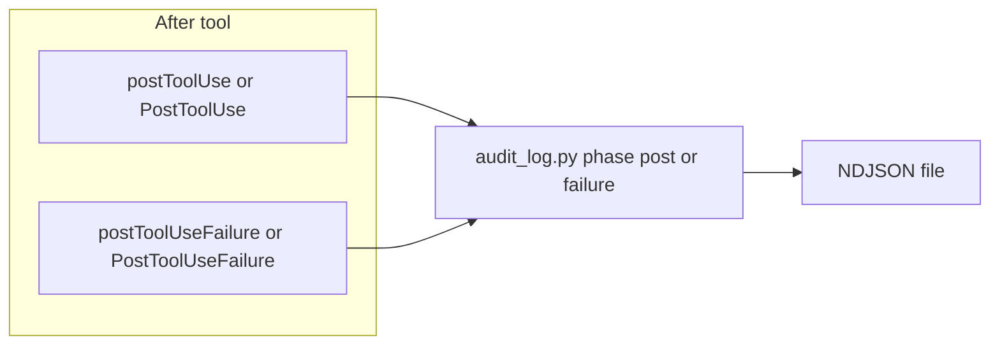

# agent-hooks

Shared **Cursor** and **Claude Code** hook scripts under `~/ai-context/agent-hooks/`: they run **before and after** tool calls, with one config file for audit sinks so `~/.cursor/hooks.json` and `~/.claude/settings.json` only need script paths and flags—not duplicated log paths or redaction lists.

| File | Role |
|------|------|
| [`compress.py`](./compress.py) | **PreToolUse** only. Rewrites selected shell commands so the executed command produces **smaller tool output** (smaller transcripts, less noise for the model). |
| [`audit_log.py`](./audit_log.py) | **PreToolUse**, **PostToolUse**, and **failure** hooks. Appends **one NDJSON record per event** to local audit files; **never writes stdout**, so it does not change tool behavior or inject tokens into the chat. |
| [`audit_config.json`](./audit_config.json) | Single source for **log paths**, **field omission**, **redaction**, and **size caps** for `audit_log.py`. |

---

## Purpose and why this exists

### Shell output compression (`compress.py`)

Agents often invoke verbose defaults: unbounded `git log`, wide `git diff`, noisy `npm install`, and similar. That floods **tool results**, which consume **context window** and trigger compaction sooner. Rewriting at the hook layer enforces a consistent, shorter shape **without** relying on the model to remember style rules every turn. The same script supports Cursor (`Shell`) and Claude Code (`Bash`) via `--format`.

### Audit logging (`audit_log.py`)

For **security, compliance, and debugging**, you need a **durable trace** of what tools ran, with what input, and what came back (or why something failed). Cursor and Claude do not expose that as a single export for all tools; **hooks** are the supported integration point. Audit lines are written to **`~/.cursor/hooks-audit.ndjson`** and **`~/.claude/hooks-audit.ndjson`** by default so logs stay next to each product’s config tree and are easy to rotate or ship to a log pipeline separately from chat transcripts.

Centralizing behavior in **`audit_config.json`** avoids copying paths and redaction rules into two JSON configs and keeps one place to tighten privacy (omit fields, redact key names) as policies change.

---

## Requirements

- Python 3.10+ (stdlib only; no pip packages)
- Writable home directories for default audit paths (or change `log_paths` in `audit_config.json`)

---

## `audit_config.json` reference

| Field | Type | Meaning |
|-------|------|---------|
| `version` | number | Schema version for humans; ignored by the script today. |
| `log_paths.cursor` | string | NDJSON file for Cursor (`~` expanded). |
| `log_paths.claude` | string | NDJSON file for Claude Code (`~` expanded). |
| `omit_keys` | string[] | Top-level keys removed from the logged payload tree (e.g. `user_email`). |
| `redact_key_substrings` | string[] | Any dict key whose lowercase name **contains** one of these substrings has its value replaced with `[REDACTED]`. |
| `max_string_chars` | number | Per-string truncation before writing (suffix notes original length). |
| `max_record_bytes` | number | Cap on UTF-8 size of the final JSON line; oversized records collapse to a small stub line so one huge tool output cannot blow the log. |

Override config location: set environment variable **`AUDIT_HOOK_CONFIG`** to an absolute path, or pass **`--config /path/to/audit_config.json`** on the `python3` command (optional; defaults to `audit_config.json` beside `audit_log.py`).

Each NDJSON line is one object:

- `ts`: UTC ISO timestamp  
- `product`: `cursor` or `claude`  
- `phase`: `pre`, `post`, or `failure`  
- `payload`: sanitized copy of the hook stdin JSON  

`audit_log.py` exits **0** on stdin/config/write errors (**fail open**) so a broken audit path does not block the agent.

---

## Installation

1. Keep this directory at a stable path (here: `~/ai-context/agent-hooks/`).
2. Point **Cursor** `~/.cursor/hooks.json` and **Claude** `~/.claude/settings.json` at `audit_log.py` (pre/post/failure) and `compress.py` (pre, shell only) as in the examples below. Use **absolute** paths to the scripts.
3. Adjust `audit_config.json` if you want different log files or stricter redaction.
4. Reload Cursor / Claude Code so hook definitions reload.

### Cursor (`~/.cursor/hooks.json`)

User hooks run with cwd `~/.cursor/`. Recommended layout: **audit first** on `preToolUse` (logs the original tool request), then **compress** with matcher `Shell` only.

```json
{
  "version": 1,
  "hooks": {
    "preToolUse": [
      {
        "command": "python3 /path/to/ai-context/agent-hooks/audit_log.py --format cursor --phase pre",
        "timeout": 5
      },
      {
        "command": "python3 /path/to/ai-context/agent-hooks/compress.py --format cursor",
        "matcher": "Shell",
        "timeout": 5
      }
    ],
    "postToolUse": [
      {
        "command": "python3 /path/to/ai-context/agent-hooks/audit_log.py --format cursor --phase post",
        "timeout": 5
      }
    ],
    "postToolUseFailure": [
      {
        "command": "python3 /path/to/ai-context/agent-hooks/audit_log.py --format cursor --phase failure",
        "timeout": 5
      }
    ]
  }
}
```

Documentation: [Cursor Hooks](https://cursor.com/docs/agent/hooks), [Claude Code Hooks](https://code.claude.com/docs/en/hooks).

### Claude Code (`~/.claude/settings.json`)

Use **`matcher": ".*"`** on `PreToolUse` so **every** tool is audited; keep **compress** in the **same** hook list **after** audit so Bash commands are still rewritten. `compress.py` only emits output for `Bash`; other tools pass through unchanged.

```json
{
  "hooks": {
    "PreToolUse": [
      {
        "matcher": ".*",
        "hooks": [
          {
            "type": "command",
            "command": "python3 /path/to/ai-context/agent-hooks/audit_log.py --format claude --phase pre",
            "timeout": 5
          },
          {
            "type": "command",
            "command": "python3 /path/to/ai-context/agent-hooks/compress.py --format claude",
            "timeout": 5
          }
        ]
      }
    ],
    "PostToolUse": [
      {
        "matcher": ".*",
        "hooks": [
          {
            "type": "command",
            "command": "python3 /path/to/ai-context/agent-hooks/audit_log.py --format claude --phase post",
            "timeout": 5
          }
        ]
      }
    ],
    "PostToolUseFailure": [
      {
        "matcher": ".*",
        "hooks": [
          {
            "type": "command",
            "command": "python3 /path/to/ai-context/agent-hooks/audit_log.py --format claude --phase failure",
            "timeout": 5
          }
        ]
      }
    ]
  }
}
```

Claude Code names the shell tool **`Bash`**; Cursor names it **`Shell`**.

---

## Architecture

High-level: two products share the same scripts; audit policy is centralized; compression applies only to shell-shaped tools.



### PreToolUse: audit then compress

Audit runs first and produces **no stdout**, so the next hook still sees the **original** stdin. Compress may then emit allow plus updated command for the shell tool only.



### Post success and failure: audit only

After the tool runs, the runtime can invoke **post** or **failure** hooks. `audit_log.py` only appends a line; it does not return `additional_context` or change outputs, so the model’s context is unchanged by audit.



---

## Behavior details

### `compress.py`

- **stdin**: Hook JSON (tool name, tool input, metadata).  
- **stdout**: If a rewrite applies, one JSON object with allow plus updated input (Cursor) or `hookSpecificOutput` (Claude). If not, **empty stdout** and exit `0`.  
- **Full tool input merge**: Claude replaces the entire `tool_input` on update; the script merges all original fields and only changes `command`. Cursor accepts merged `updated_input` for consistency.  
- **Compound commands**: Rewrites apply to the rightmost matching segment of `&&` / `;` chains so `cd repo && git log` still compresses.

### `audit_log.py`

- **stdin**: Same hook JSON the runtime provides for that event (including `tool_output` on post success where applicable).  
- **stdout**: Always empty (by design).  
- **Phases**: `--phase pre` / `post` / `failure` align with Cursor’s `preToolUse` / `postToolUse` / `postToolUseFailure` and Claude’s `PreToolUse` / `PostToolUse` / `PostToolUseFailure`.

---

## Effect on context usage and performance

This section is about **model context** (tokens visible to the agent in the thread) and **local** cost.

| Mechanism | Effect on model context / transcript tokens | Other effects |
|-----------|---------------------------------------------|---------------|
| **`compress.py`** | **Reduces** context pressure when rewrites apply, because the **executed** command returns **less text** in the tool result (e.g. bounded `git log`, tailed diffs). Fewer tokens in tool outputs → more room for reasoning and files before compaction. | Small **latency** per matched shell call (Python + JSON). No extra tokens added to the chat. |
| **`audit_log.py`** | **No direct effect.** It does not print to stdout and does not inject `additional_context`. Nothing it writes is automatically read back into the agent. | **Disk**: NDJSON files grow with every tool event; rotate or ship logs operationally. **Latency**: one extra Python process per configured hook invocation (typically a few ms unless IO is slow). **Security**: logs can still contain sensitive strings if keys do not match `redact_key_substrings`; treat files like operational secrets. |

**Summary:** Compression is a **context-shaping** control. Audit is **observability** outside the model loop unless you deliberately feed log lines back into a prompt. If you open audit files in the editor or paste them into chat, *that* action consumes context; the hooks themselves do not.

---

## Manual testing

From `agent-hooks/` (adjust paths):

**Compress — Cursor-shaped**

```bash
printf '%s\n' '{"tool_name":"Shell","tool_input":{"command":"git log","working_directory":"/tmp"}}' \
  | python3 compress.py --format cursor
```

**Compress — Claude-shaped**

```bash
printf '%s\n' '{"tool_name":"Bash","tool_input":{"command":"git log","working_directory":"/tmp"}}' \
  | python3 compress.py --format claude
```

**Compress — compound command**

```bash
printf '%s\n' '{"tool_name":"Shell","tool_input":{"command":"cd /tmp && git log"}}' \
  | python3 compress.py --format cursor
```

**Audit — append one line**

```bash
printf '%s\n' '{"tool_name":"Shell","tool_input":{"command":"echo hi"}}' \
  | python3 audit_log.py --format cursor --phase pre
tail -n 1 ~/.cursor/hooks-audit.ndjson | python3 -m json.tool
```

**Validate JSON configs**

```bash
python3 -m json.tool ~/.cursor/hooks.json
python3 -m json.tool ~/.claude/settings.json
python3 -m json.tool audit_config.json
```

---

## How to verify in agent chat

Same idea for Cursor and Claude: for `git log`, a working compress hook yields a **short graph-style** history (on the order of tens of lines), not thousands of lines of default `git log`.

| Signal | Compress likely **on** | Compress likely **off** |
|--------|-------------------------|---------------------------|
| Line count | Roughly **~30** commits worth of one-line graph output | Very large output or hard truncation in the UI |
| Commit shape | One line per commit | Multi-line blocks with full metadata |

Toggle hooks in config, reload the app, repeat the same prompt to compare.

### Cursor

Use the **Hooks** output channel if available. If it stays empty, verify paths and restart Cursor.

### Claude Code

Look for **`Bash(…)`** and small line counts on rewritten commands.

---

## Rewrite rules (summary)

`compress.py` shortens or tails common commands (`git`, `npm`/`npx`, `pip`, `aws`, `pytest`, `tsc`, `docker`, `ls`, …). It **skips** when the command already limits output (`| head`, `--oneline`, `| jq`, etc.).

---

## Troubleshooting

| Symptom | What to check |
|---------|----------------|
| Hook never runs | Paths in `hooks.json` / `settings.json`; matchers (`Shell` vs `Bash`); restart the app. |
| Claude bash not rewritten | `tool_name` must be `Bash`; `compress.py` must run in the `PreToolUse` list. |
| Invalid JSON / hook errors | Run the manual `printf \| python3` tests; Python 3.10+. |
| Claude breaks after rewrite | Use a `compress.py` that merges **full** `tool_input`, not only `command`. |
| No audit lines | `log_paths` in `audit_config.json`; directory writable; `AUDIT_HOOK_CONFIG` if you override path. |
| Audit disk usage | Lower `max_string_chars` / `max_record_bytes`; rotate NDJSON files; narrow hooks if product allows matchers on post events only for certain tools. |

---

## License

Use and modify for your own setup; no warranty implied.
